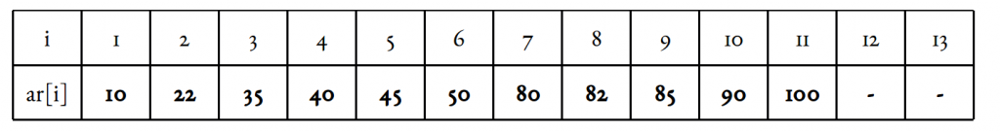

# Fibonacci Search
Given a sorted array arr[] of size n and an element x to be searched in it. Return index of x if it is present in array else return -1.
## Examples:

Input:  arr[] = {2, 3, 4, 10, 40}, x = 10
Output:  3
Element x is present at index 3.

Input:  arr[] = {2, 3, 4, 10, 40}, x = 11
Output:  -1
Element x is not present.

Fibonacci Search is a comparison-based technique that uses Fibonacci numbers to search an element in a sorted array.

## Similarities with Binary Search:

    Works for sorted arrays
    A Divide and Conquer Algorithm.
    Has Log n time complexity.

## Differences with Binary Search:

    Fibonacci Search divides given array in unequal parts
    Binary Search uses division operator to divide range. Fibonacci Search doesn’t use /, but uses + and -. The division operator may be costly on some CPUs.
    Fibonacci Search examines relatively closer elements in subsequent steps. So when input array is big that cannot fit in CPU cache or even in RAM, Fibonacci Search can be useful.

## Background:
Fibonacci Numbers are recursively defined as F(n) = F(n-1) + F(n-2), F(0) = 0, F(1) = 1. First few Fibinacci Numbers are 0, 1, 1, 2, 3, 5, 8, 13, 21, 34, 55, 89, 144, …

## Observations:
Below observation is used for range elimination, and hence for the O(log(n)) complexity.

F(n - 2) &approx; (1/3)*F(n) and 
F(n - 1) &approx; (2/3)*F(n).

## Algorithm:
Let the searched element be x.

The idea is to first find the smallest Fibonacci number that is greater than or equal to the length of given array. Let the found Fibonacci number be fib (m’th Fibonacci number). We use (m-2)’th Fibonacci number as the index (If it is a valid index). Let (m-2)’th Fibonacci Number be i, we compare arr[i] with x, if x is same, we return i. Else if x is greater, we recur for subarray after i, else we recur for subarray before i.

Below is the complete algorithm
Let arr[0..n-1] be the input array and element to be searched be x.

    Find the smallest Fibonacci Number greater than or equal to n. Let this number be fibM [m’th Fibonacci Number]. Let the two Fibonacci numbers preceding it be fibMm1 [(m-1)’th Fibonacci Number] and fibMm2 [(m-2)’th Fibonacci Number].
    While the array has elements to be inspected:
        Compare x with the last element of the range covered by fibMm2
        If x matches, return index
        Else If x is less than the element, move the three Fibonacci variables two Fibonacci down, indicating elimination of approximately rear two-third of the remaining array.
        Else x is greater than the element, move the three Fibonacci variables one Fibonacci down. Reset offset to index. Together these indicate elimination of approximately front one-third of the remaining array.
    Since there might be a single element remaining for comparison, check if fibMm1 is 1. If Yes, compare x with that remaining element. If match, return index.

## Illustration:
Let us understand the algorithm with below example:

